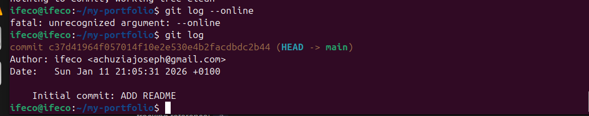
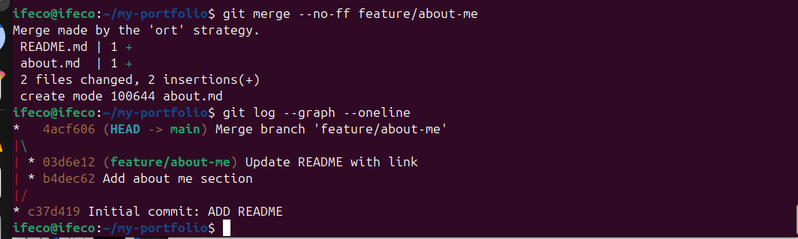
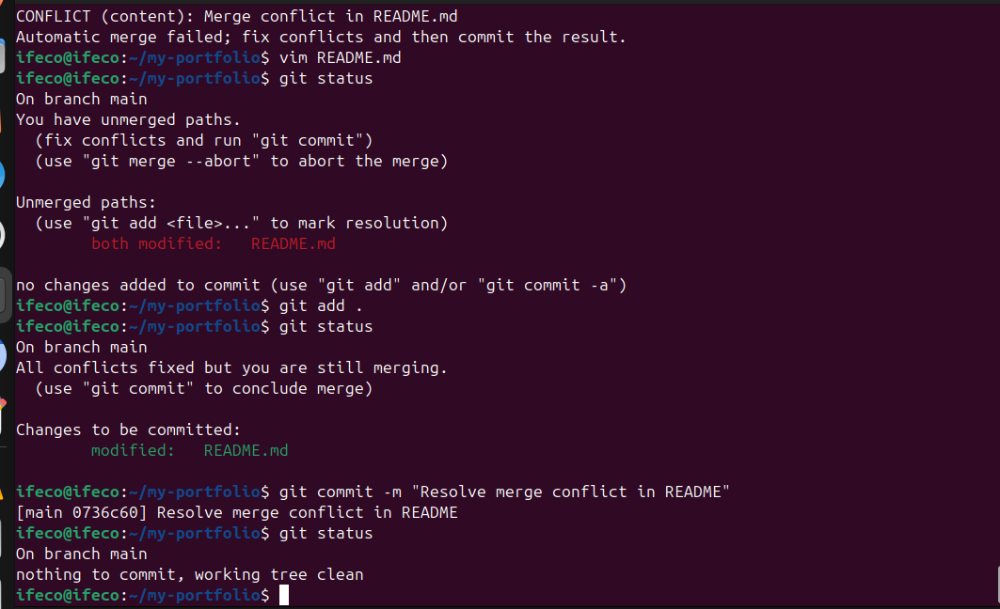
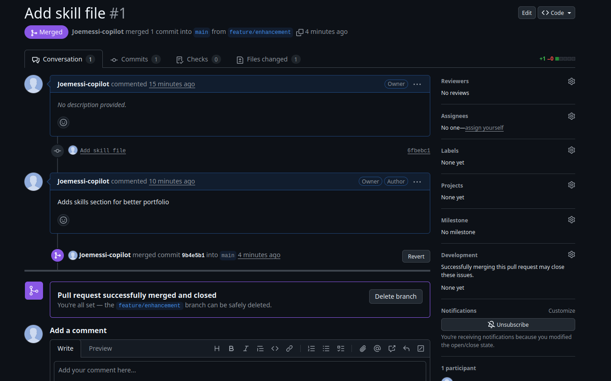

# A brief reflection: What was challenging?
I didn't find anything chanllenging after going through the recorded video of the class.

# How does Git help in DevOps teams?
It helps different teams to collaborate remotely

# Any issue faced and how resolved
I had issue with linking the about file in the README file and i resolved it by checking on google to get solution which i got and it worked.

